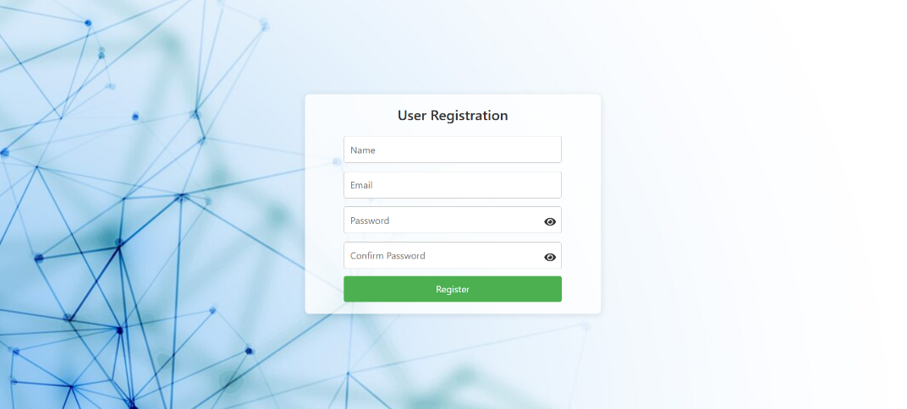
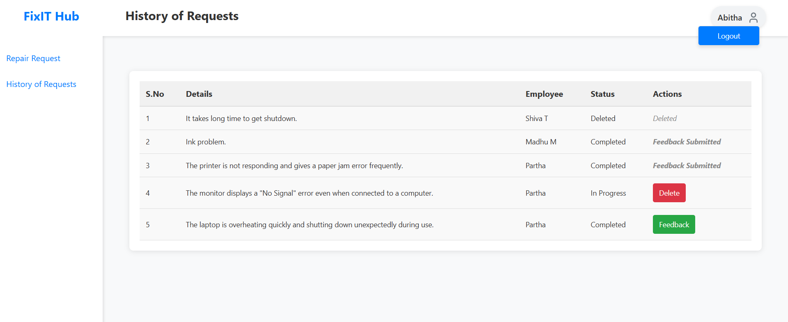
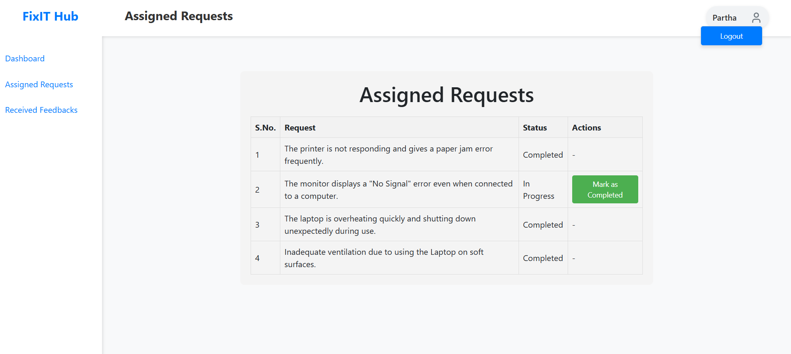
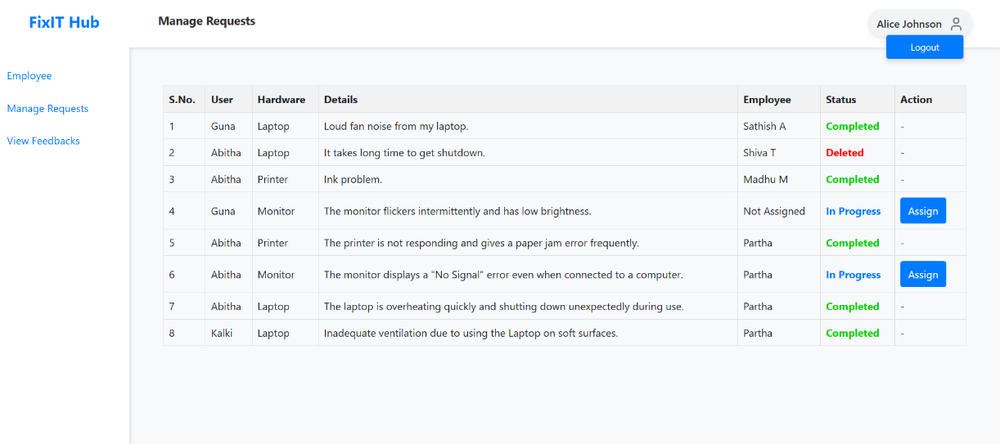
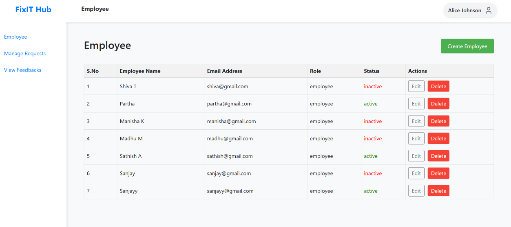
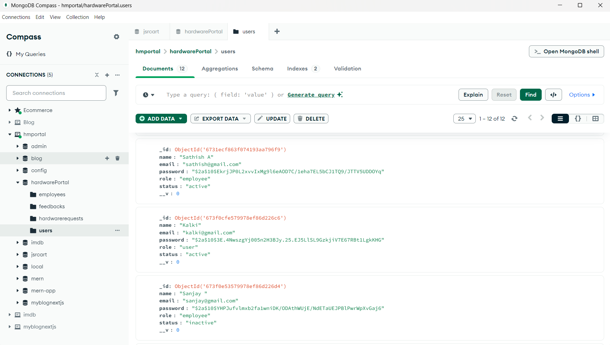

**MERN Stack Hardware Management Portal**

**(FixIT Hub)**

**Abstract:**

The MERN Stack Hardware Management Portal is a full-stack web
application designed to efficiently manage hardware repair and service
requests. Leveraging the MERN (MongoDB,

Express.js, React.js, Node.js) stack, this portal provides a seamless
interface for users, employees, and administrators to interact with the
system.

Users can submit repair requests, track their history, and provide
feedback, while administrators oversee requests and employees manage
their assigned tasks. The system emphasizes role-based access control
and offers a user-friendly experience with responsive design and dynamic
functionality.

**Tech-Stacks:**

MERN Stack, Node.js, React.js, MongoDB, Express.js.

**WORKFLOW:**

Here\'s the step-by-step process:

**[1. User Workflow:]**

The User role is focused on submitting repair requests, viewing request
histories, and providing feedback.

**1. Login/Registration:**

-   User logs in or registers through the portal.

-   The system authenticates the user and assigns the role \`user\`.
    

Fig 1. Registration Page

**2. Submit Repair Request:**

-   Navigate to the Repair Request page.

-   Fill out a form with details like device type, issue description,
    and priority.

-   Submit the form, which creates an entry in the \`requests\`
    collection.

**3. View Repair History:**

-   Navigate to the Request History page.

-   View all previously submitted repair requests, including their
    status (e.g., pending, in-progress, completed).

**4. Provide Feedback:**

-   After a repair request is marked as completed, the user can submit
    feedback.

-   Feedback is stored in the \`feedback\` collection for admin review.
    

Fig 2. Repair Request Page

**[2. Employee Workflow:]**

The Employee role manages assigned repair requests.

**1. Login:**

\- Employee logs in, and the system authenticates them with the role
\`employee\`.

**2. View Assigned Requests:**

-   Navigate to the Assigned Requests page.

-   See a list of repair requests assigned by the admin.

**3. Update Request Status:**

-   Open a specific request and view details.

-   Update the request status (e.g., from \"in-progress\" to
    \"completed\").

-   Changes are saved in the \`requests\` collection.

> 

Fig 3. Assigned Request Page

**[3. Admin Workflow:]**

The Admin role oversees the entire system, managing users, requests, and
feedback.

**1. Login:**

\- Admin logs in, and the system authenticates them with the role
\`admin\`.

**2. Manage Users:**

-   Navigate to the Manage Users page.

-   Add, edit, or delete user accounts with specific roles (\`user\`,
    \`employee\`, or \`admin\`).

**3. Assign Repair Requests:**

-   Navigate to the Manage Requests page.

-   View a list of all repair requests.

-   Assign specific requests to employees based on availability and
    expertise.

**4. View Feedback:**

-   Navigate to the Feedback Overview page.

-   View user feedback for completed requests.

-   Use feedback data to improve operations.

> 

Fig 4. Assign Repair Request Page

Fig 5. Employee List

**[4. Authentication Workflow (For All Roles):]**

**1. Token-Based Authentication:**

-   Upon successful login, the system generates a JSON Web Token (JWT).

-   This token secures API calls and validates user sessions.

**2. Role-Based Access Control:**

-   Based on the \`role\` field in the \`users\` collection, the system
    restricts access to certain pages and functionalities:

-   \`user\`: Access repair requests, history, and feedback forms.

-   \`employee\`: Access assigned requests and status updates.

-   \`admin\`: Access user management, request assignment, and feedback
    review.

> 

Fig 6. Role-Based Access Control from MongoDB

**[5. Request Handling Workflow:]**

**1. Request Creation:**

\- When a user submits a repair request, it is saved in the \`requests\`
collection with an initial status of \"pending.\"

**2. Request Assignment:**

-   The admin assigns the request to an employee.

-   The assigned employee\'s ID is linked to the request.

**3. Status Updates:**

-   The employee updates the request status as they work on it.

-   Status updates are reflected in both the employee and user
    dashboards.

**[6. Feedback Handling Workflow:]**

**1. Feedback Submission:**

\- After a request is marked as \"completed,\" the user submits feedback
through a form.

**2. Feedback Storage:**

\- Feedback is saved in the \`feedback\` collection, including details
like user ID, request ID, and comments.

**3. Feedback Review:**

\- Admins review feedback to identify areas of improvement.

**[7. Summary of Workflow Flowchart:]**

**1. User:**

\- Login → Submit Request → View History → Provide Feedback.

**2. Employee:**

\- Login → View Assigned Requests → Update Status.

**3. Admin:**

\- Login → Manage Users → Assign Requests → View Feedback.

This step-by-step workflow ensures efficient and transparent management
of hardware repair processes for all stakeholders.

**RESULTS:**

The completed portal offers:

1.  Streamlined management of hardware repair requests.

2.  Role-based access control ensuring secure operations.

3.  Enhanced user satisfaction through a responsive interface.

4.  Efficient workflows for employees and administrators.

**FUTURE SCOPE:**

**1. Enhanced Reporting:**

\- Add detailed analytics dashboards for request trends and employee
performance.

**2. Notifications:**

\- Integrate email or SMS notifications for updates on request statuses.

**3. Multi-language Support:**

-   Provide localized versions of the portal for wider adoption.

-   Enable file uploads (e.g., receipts or images of hardware issues).

**4. AI-Based Assignments:**

\- Utilize machine learning to auto-assign requests based on employee
availability and expertise.
